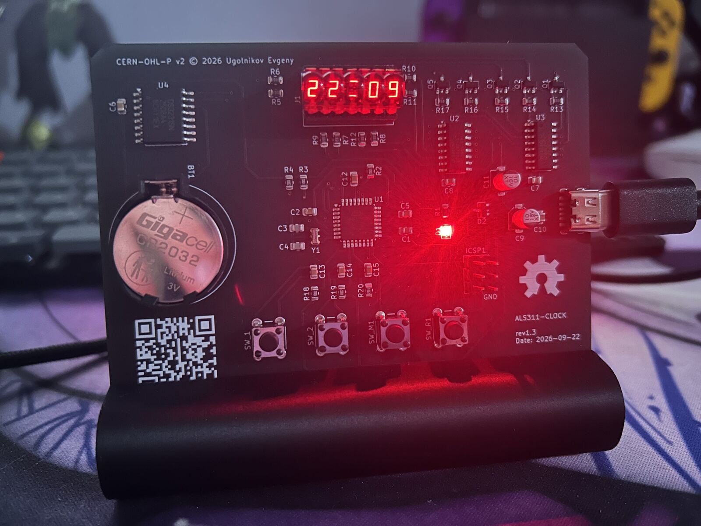

# als311-clock

A clock built around the Soviet ALS311 LED display — I made it as a gift for my wife.
It runs on an ATmega328P with firmware written in C. The firmware uses an asynchronous
model: all drivers and HAL functions operate without blocking the main loop.



Prebuilt firmware and fabrication files (Gerbers, BOM) are on the
[Releases](https://github.com/ugolnikovE/als311-clock/releases) page.

## Components

| Component | Qty |
| --- | --- |
| ATmega328P microcontroller | 1 |
| DS3231M real-time clock | 1 |
| 74HC595 shift register | 2 |
| ALS311 7-segment display | 1 |
| MMBT2222A transistor | 5 |
| BAT54C Schottky diode | 1 |
| LED | 1 |
| 16 MHz crystal | 1 |
| USB-C connector (power) | 1 |
| CR2032 battery + holder | 1 |
| Tactile push button | 4 |
| ICSP programming header | 1 |
| Resistors (1 k / 4.7 k / 10 k) | 20 |
| Capacitors (0.1 µF / 22 pF / 10 µF) | 15 |

> [!WARNING]
> Double-check resistor values **and units** when ordering parts and before soldering.
> 4.7 Ω and 4.7 kΩ look almost the same in a shop listing, and the board will not
> work with the wrong one.

## Schematic

Full multi-sheet schematic: [docs/schematic.pdf](docs/schematic.pdf).
KiCad sources are in [hardware](hardware).

## PCB

KiCad layout: [hardware/hardware.kicad_pcb](hardware/hardware.kicad_pcb).

## Enclosure

A stand that holds the board at an angle. FreeCAD source in
[hardware/enclosure](hardware/enclosure).

## Firmware

### Requirements

- avr-gcc
- avrdude
- Make

For working with the hardware sources: KiCad 9, and FreeCAD (for the stand, optional).

### Build

```bash
cd firmware
make
```

### Flash

The board has no bootloader. It is programmed over the ICSP header (USBasp by default).

```bash
cd firmware
make upload
```

### First flash: fuses

A new ATmega328P runs from its internal RC oscillator at 1 MHz. The firmware expects
an external 16 MHz crystal, so on a new chip set the fuses once before the first upload:

```bash
avrdude -c usbasp -p m328p -B 32 \
    -U lfuse:w:0xFF:m -U hfuse:w:0xD9:m -U efuse:w:0xFD:m
```

| Fuse | Value | Meaning |
| --- | --- | --- |
| lfuse | `0xFF` | external crystal 8–16 MHz, CKDIV8 off |
| hfuse | `0xD9` | no bootloader (BOOTRST off), SPIEN on |
| efuse | `0xFD` | brown-out detection at 2.7 V |

Notes:

- `-B 32` slows the ISP clock down. A 1 MHz chip will not answer at the default speed.
  Once the fuses are set, `make upload` works at normal speed.
- Solder the crystal and its 22 pF capacitors **before** writing the fuses. With these
  fuses the chip will not start without a working crystal, so ISP can't reach it either.

## Contributing

Ideas, bug reports and any contributions are welcome — feel free to open an issue
or a pull request.

## License

- **Firmware** (`/firmware`) — MIT, see [LICENSE](LICENSE).
- **Hardware** (`/hardware`) — schematics, PCB and enclosure — CERN-OHL-P v2,
  see [LICENSE-HARDWARE](LICENSE-HARDWARE) and [hardware/NOTICE](hardware/NOTICE).
